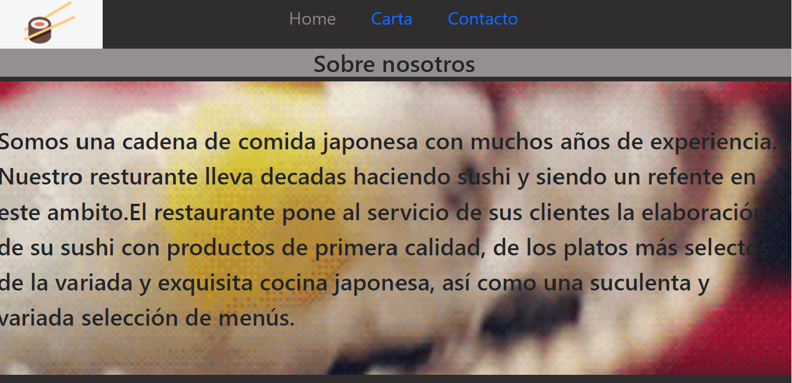
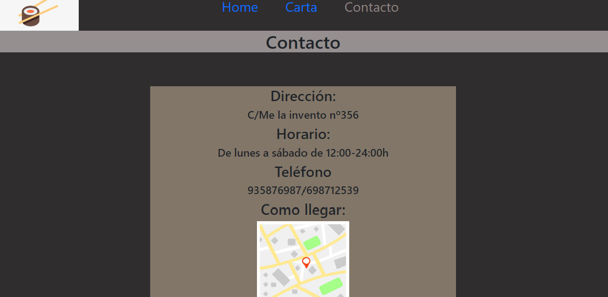
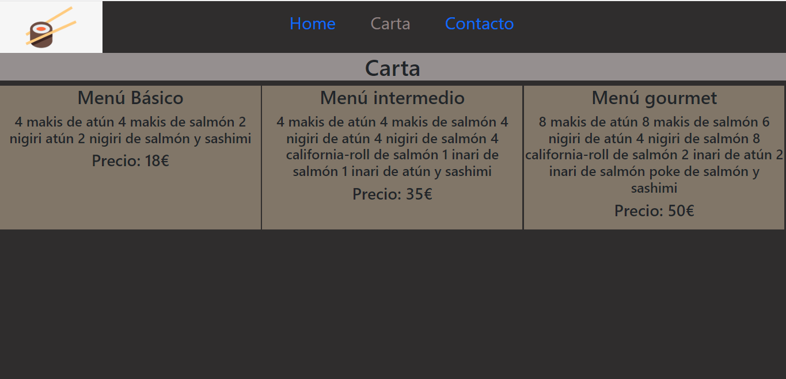

<h1 >Página web de restaurante</h1>

[Ver el proyecto] ()

## Como lo he hecho

He utilizado html y css para dar forma a una página web. Me he valido de gif e imagenes para poder representar como sería una página de un restaurante de sushi. Adjunto imagenes de como sé  ve la página que he creado.

